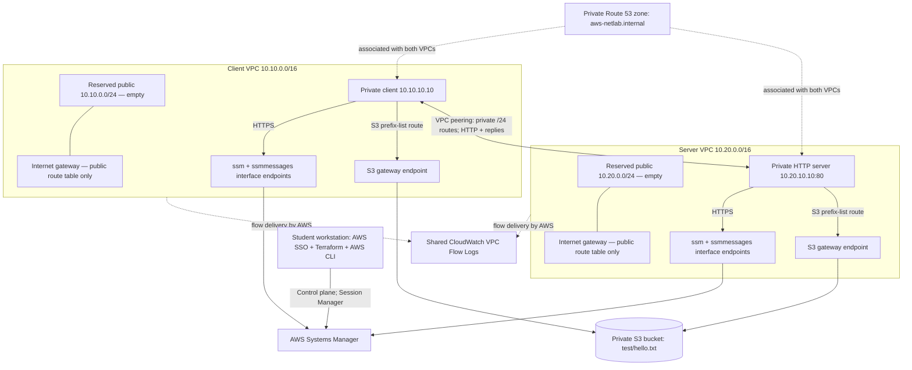

# AWS Network Infrastructure and Troubleshooting Lab

A **personal portfolio lab** for a networking graduate moving into cloud engineering. Build two isolated application networks, connect a private client to a private HTTP service, and investigate five deliberately introduced failures using Terraform, Linux tools, and AWS evidence.

The business scenario is a small team connecting an internal application environment to a separate consumer environment. The exercise asks: can the team explain the path of a request, restrict its access, identify the failing layer, and restore the intended configuration reproducibly?

**Status:** implemented locally; no AWS resources deployed or live results claimed. See [validation results](docs/validation.md). This is a single-AZ learning environment, not production experience or a highly available platform.

## What you will demonstrate

- IPv4 address planning, private route tables, VPC peering, stateful security groups and stateless ACLs.
- Credential-free instance administration through Session Manager with no inbound SSH.
- Terraform modules, a committed provider lock file, bounded automation, and plan checks that reject unrelated changes during fault exercises.
- Linux request-path diagnosis, private DNS, S3 authorization, and defensible interpretation of Flow Logs.
- Incident reports backed by real evidence, honest cost estimates, and verified teardown.

## Architecture



Both VPCs use the same AZ. Each contains one public and one private subnet. Private route tables have no default internet route. Public subnets are empty and protected by deny-all ACLs. No NAT gateway, public instance IP, SSH key, load balancer, or Transit Gateway is created. See [address plan and connectivity matrix](docs/architecture.md).

## Quick start

Read [setup and IAM requirements](docs/setup.md), [security choices](docs/security.md), and the [dated cost estimate](docs/costs.md) first. Default continuous operation is estimated at **about $47/month** under the listed small-traffic assumptions; this is not a free lab. Stopping EC2 does not stop endpoint charges.

Commands run from this repository root on Linux/macOS (or WSL). Install Python 3.9+, AWS CLI v2, Terraform 1.10+, and the Session Manager plugin. Development checks use Python 3.12 and pinned tools.

```bash
python3 -m venv .venv
source .venv/bin/activate
python -m pip install -r requirements-dev.txt
./scripts/static-checks.sh                  # no AWS credentials or deployment

aws configure sso --profile netlab          # your IAM Identity Center setup
aws sso login --profile netlab
export AWS_PROFILE=netlab
cp terraform/terraform.tfvars.example terraform/terraform.tfvars
# Edit terraform/terraform.tfvars: replace account ID; choose owner/settings.
python3 scripts/lab.py prereq --account YOUR_12_DIGIT_ACCOUNT_ID
```

`prereq` performs read-only AWS checks and saves a local account/Region/lab guardrail. Replace the uppercase placeholder. The generated `.lab/config.tfvars.json` takes precedence over `terraform.tfvars` for account, Region, lab ID, scenario, and pinned AMI; use `prereq --region ... --lab-id ...` initially if needed.

**Only after deciding to incur AWS charges:**

```bash
python3 scripts/lab.py deploy --approve
python3 scripts/lab.py test
python3 scripts/lab.py flow-logs
python3 scripts/lab.py inventory
python3 scripts/lab.py session client
```

`deploy` prints and checks the Terraform plan, applies it, waits up to 20 minutes for SSM/bootstrap, and verifies HTTP, DNS, and S3. `--approve` is your explicit authorization for that command to change this lab. It is not used by CI.

## Exercise loop

Always restore and verify the baseline before starting the next exercise. Each guide includes expected **patterns**, not invented execution output.

| Fault | Change | Guide |
|---|---|---|
| `routing` | Remove client private-subnet route to server /24 | [Routing](docs/scenarios/01-routing.md) |
| `security-group` | Remove server TCP/80 ingress | [Security group](docs/scenarios/02-security-group.md) |
| `nacl` | Deny server return traffic to client ephemeral ports | [Network ACL](docs/scenarios/03-nacl.md) |
| `dns` | Remove the private application A record | [DNS](docs/scenarios/04-dns.md) |
| `s3-policy` | Deny the one object through client S3 endpoint | [S3 policy](docs/scenarios/05-s3-policy.md) |

```bash
python3 scripts/lab.py inject routing --approve
python3 scripts/lab.py test --expect routing
python3 scripts/lab.py evidence
python3 scripts/lab.py restore --approve
python3 scripts/lab.py test
# Repeat with one of the other scenario names.
```

For the complete live integration suite (changes resources; may take 30–60 minutes):

```bash
python3 scripts/lab.py integration --approve
# Runs all five failures, controls, recovery tests, and Flow Log checks.
# Leaves the healthy lab RUNNING. Destroy it when finished.
```

DNS restoration may wait up to 17 minutes for negative-cache expiry. Faults preserve the management path by design; restoration uses your workstation's AWS control-plane connection and does not depend on working HTTP or DNS on the instances.

## Evidence and cleanup

```bash
python3 scripts/lab.py evidence
python3 scripts/lab.py destroy --approve
python3 scripts/lab.py verify-destroy
```

Destroy removes resources tracked by this lab's state, including its object and logs, then checks recorded resource IDs and empty state. Export evidence first. Keep `.lab/`, state, and the same AWS identity until deletion is verified. See [teardown and interrupted operations](docs/operations.md). Do not upload unrelated objects into the dedicated bucket: `force_destroy=false` deliberately prevents their silent deletion.

## Repository map

```text
terraform/
  versions.tf, variables.tf, main.tf, outputs.tf, terraform.tfvars.example
  .terraform.lock.hcl
  modules/{network,peering,endpoints,compute,logging,storage}/
  tests/*.tftest.hcl
scripts/
  lab.py                   # prereq/deploy/test/inject/restore/evidence/destroy
  static-checks.sh
  inventory-env.py          # safely quoted local diagnostic environment
  on-instance.sh            # non-mutating Linux diagnostic snapshot
tests/test_lab.py          # offline automation safety contracts
.github/workflows/static.yml
.checkov.yaml, requirements-dev.txt, pyproject.toml
docs/                      # setup, architecture, costs, security, operations,
                           # five scenarios, queries, demo, interviews, validation
evidence/                  # ignored live output; checklist only at delivery
```

See the [test contract](docs/testing.md). Browse the [five-minute demo](docs/demo.md), [interview answers and resume templates](docs/portfolio.md), [diagnostic reference](docs/diagnostics.md), [Logs Insights queries](docs/queries.md), and [official sources](docs/sources.md).
